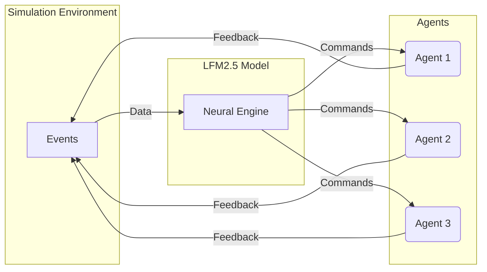

  
  

```mermaid
graph LR
    subgraph World [Simulation Environment]
        E[Events]
    end

    subgraph Brain [LFM2.5 Model]
        N[Neural Engine]
    end

    subgraph Actors [Agents]
        A1(Agent 1)
        A2(Agent 2)
        A3(Agent 3)
    end

    E -->|Data| N
    N -->|Commands| A1 & A2 & A3
    A1 & A2 & A3 -->|Feedback| E
```
