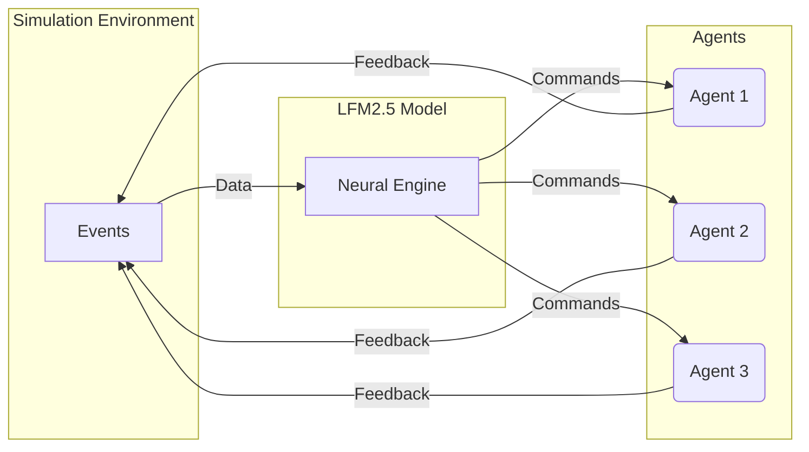

  <!-- ЛОГОТИП -->
  
  

  <!-- БЕЙДЖИ -->
  
  
  

 ### 🏗️ Architecture
 
<b> Multi-agent simulation driven by a small-form neural network</b>

The system is based on the interaction of three independent agents and a central neural network.

