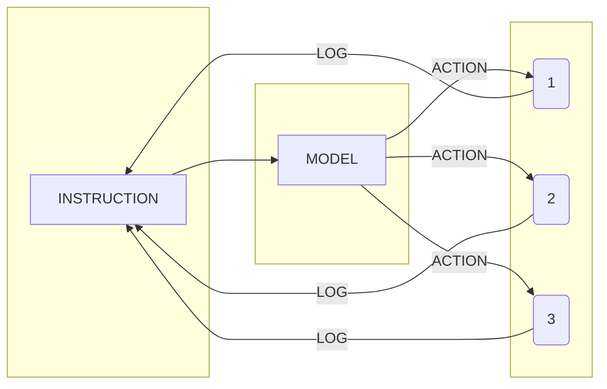

  

```mermaid
graph LR
    subgraph World [ ]
        E[INSTRUCTION]
    end

    subgraph Brain [ ]
        N[MODEL]
    end

    subgraph Actors [ ]
        A1(1)
        A2(2)
        A3(3)
    end

    E -->| | N
    N -->|ACTION| A1 & A2 & A3
    A1 & A2 & A3 -->|LOG| E
```
